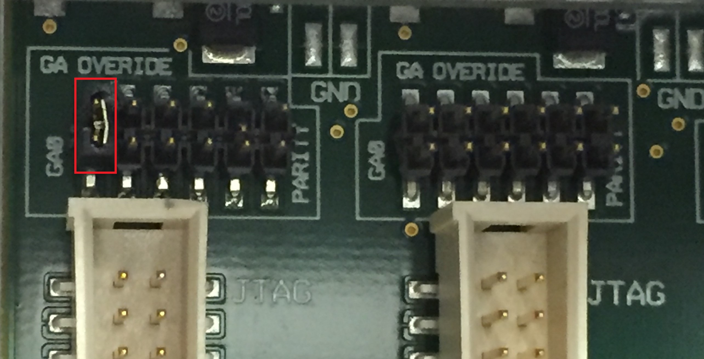
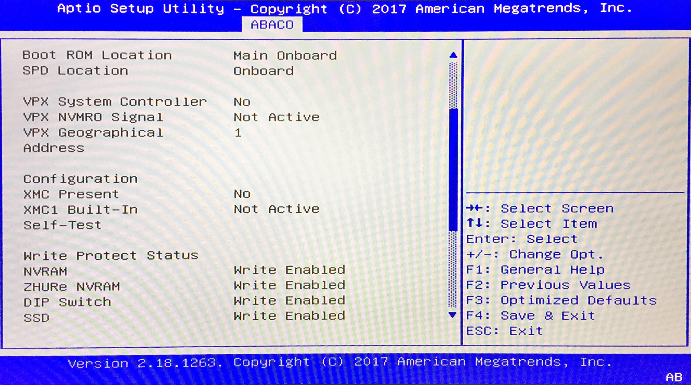

# Serial IPMI Windows 
Example of how to interface with IPMI over serial on Abaco Systems single board computers. This code was created using the examples provided in the Software Reference Manual, BMM / BMC with VITA46.11 Support, Edition 3 available for downmoad from the Abaco Systems Website.

## Build instructions
Software was build using Visual Studio 2017 using the following steps.
* Open a Build shell from Start -> x64 Native Tools Command Prompt for VS 2017
* Change directory to the git clone. Location of the MAKEFILE.
* Type **nmake**
* Execute the resulting binary **example.exe**

## Expected output
```
Abaco Systems IPMI test on slot 0x82 on COM3

Opening serial port successful
IPMI Messgae :
0xa0 0x82 0x18 0x66 0x01 0x02 0x01 0xfc 0xa5
Awaiting response CTRL+C to finish...
0xA0 0x1 0x1E 0xE1 0x82 0x0 0x1 0x0 0x0 0x81 0x5 0x3 0x2 0x1D 0x28 0x8 0x0 0x86 0x0 0x0 0x0 0x0 0x0 0x1F 0xA5 0xA6
```

# SBC328 Setup

The code was tested against the SBC328 single board computer. Details of the performed tests are provided below.

Chassis used was the Abaco Systems SCVPX3U. This chassis requires the Geographical Addressing to be configured on the backplane using jumpers. The SBC328 was installed in SLOT 1 and given the geographical address 1 by fitting the jumper as shown below:



To check the geographical address on the SBC328 before your run the example enter the BIOS and look for the reported address under the ABACO -> FPGA menu as shown below:



VPX Geographical Address should report the value 1. If you require this code to work in any other slot then you will need to modify the line below in the code to indicate the slot you wish to function in:

```C
#define SLOT SLOT_1
...
unsigned char ipmi_message[] = { SLOT, 0x18, 0x00, 0x01, 0x02, 0x01, 0x00 };
```


# Links
* [SBC328](https://www.abaco.com/products/sbc328-3u-openvpx-single-board-computer)
* [SCVPX3U Test Chassis](https://www.abaco.com/products/scvpx3u/n3555)
* [BMM / BMC with VITA46.11 Support](https://www.abaco.com/download/bmmbmc-vita4611-support-software-reference-manual)


